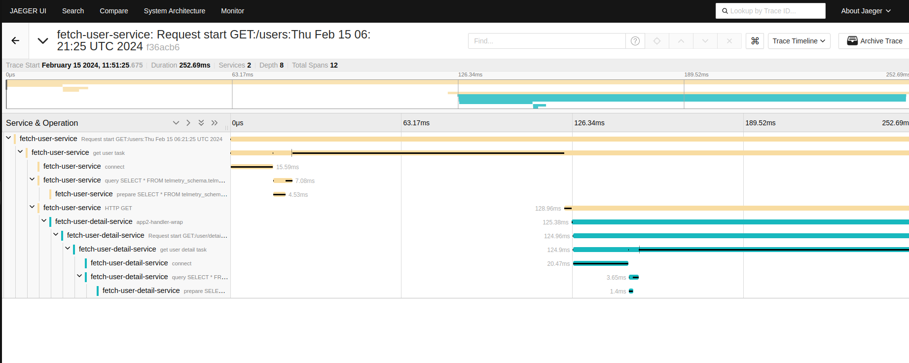

# Distributed tracing using Opentelemetry

This code demonstrates the distributed tracing capabilties of the Opentlemetry standard.

To know more about the standard please visit this [link](https://www.cncf.io/projects/opentelemetry/).

### Commands

```console
make serve
```

This will make the /users path available at **localhost:8000**, it will also make the Jaeger UI available at **localhost:5000**.

The /users path will generate traces which can be observed in the UI.

The traces will be listed under service names **fetch-user-service** and **fetch-user-detail-service** respectively.

### Example of illustration



Above are traces of two separate services, **fetch-user-service** and **fetch-user-detail-service**. However the trace of request can be visualized as one.

**fetch-user-service** makes a call to **fetch-user-detail-service** hence propogating the trace.